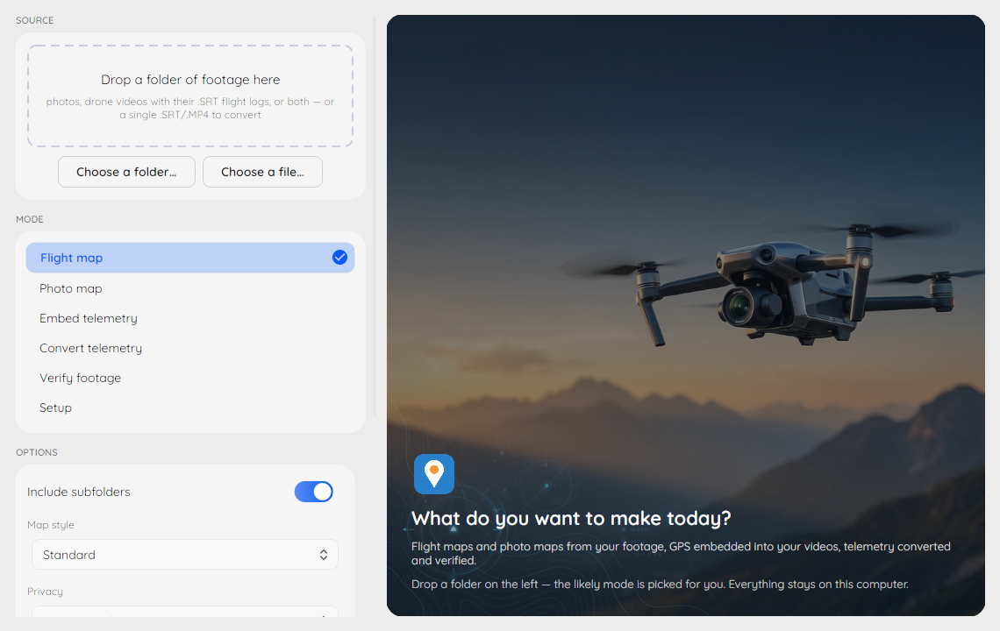
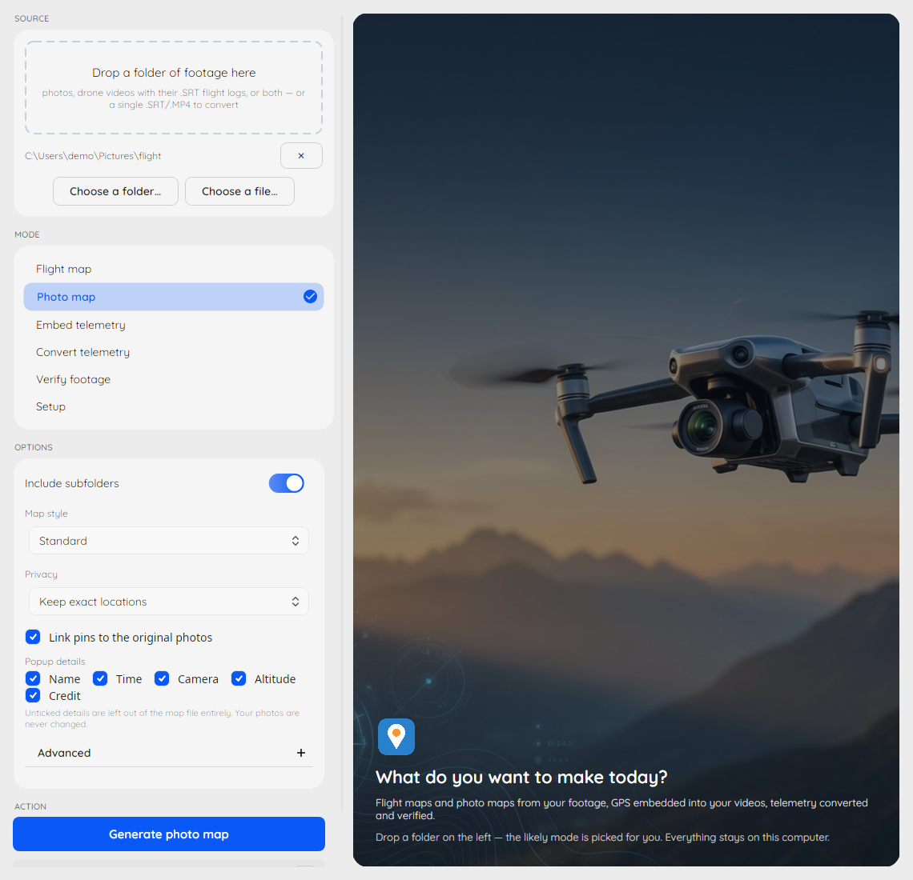
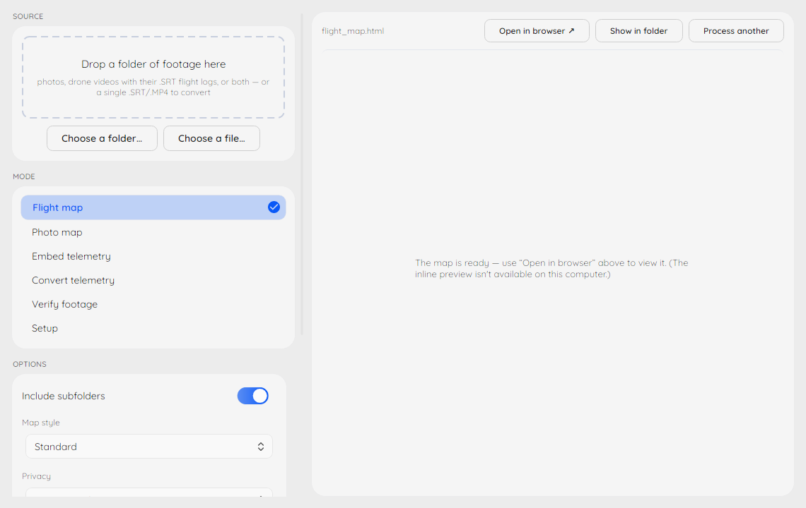
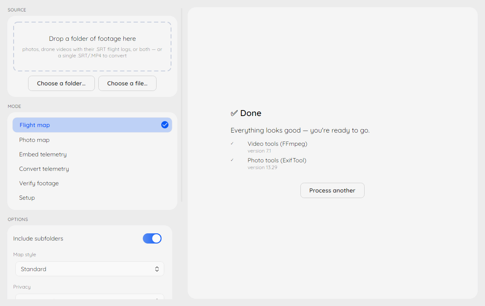

# Desktop App

The **DJI Metadata Embedder** desktop app is a Windows front-end for the
`dji-embed` command line: drop a folder of footage, pick what to make, and
watch the exact CLI command it runs in the strip under the Run button —
everything the app does, the terminal can do too.

## Install

Download the installer (`dji-metadata-embedder-setup-<version>.exe`) from
the [latest release](https://github.com/CallMarcus/dji-drone-metadata-embedder/releases/latest)
and run it — no admin rights needed. You get the desktop app in the Start
menu plus the full `dji-embed` command line in any terminal, with FFmpeg
and ExifTool bundled.

Already using winget? `winget install CallMarcus.DJIMetadataEmbedder`
installs the portable command line only — the desktop app ships with the
installer.

## The six modes

Drop a folder (or a single `.SRT`/`.MP4` file) into **Source** and the
likely mode is picked for you. The **Mode** strip offers:

- **Flight map** — one interactive map of every flight in the folder,
  with playback. Needs videos with their `.SRT` flight logs.
- **Photo map** — your still photos pinned on a map, including a full
  360° panorama viewer for drone panoramas.
- **Embed telemetry** — writes each flight log's GPS track into the video
  files themselves (as copies — originals are never touched).
- **Convert telemetry** — one flight log or video into GPX, KML, CSV,
  GeoJSON or CoT, for Google Earth and mapping tools.
- **Verify** — checks embedded metadata, video/log pairing drift, or
  cross-checks the recorded time and place against the sun's position.
- **Setup** — confirms FFmpeg and ExifTool are ready, and can install
  what's missing.

Each mode shows a small set of curated options — the full flag surface
stays on the [command line](user_guide.md). The strip under the Run
button always shows the exact `dji-embed` command those options build.

## Maps preview inside the app

Finished maps open right in the app, panoramas included:

Inline preview uses Microsoft Edge WebView2, preinstalled from Windows 11
on. Without it the app quietly opens results in your browser instead —
nothing is lost.

## Privacy and stored state

Everything runs on your computer; nothing is uploaded, and there is no
telemetry. The app stores exactly two things locally in
`%APPDATA%\DjiEmbed\state.json`: your recent folders and the window
size/position. Delete that file to reset both.
