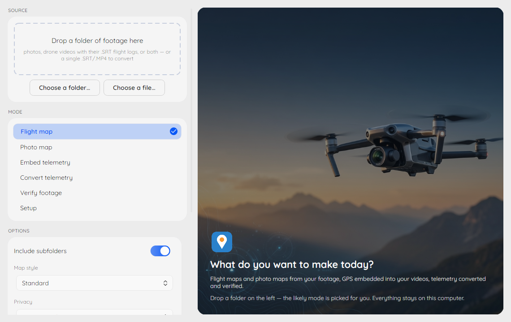
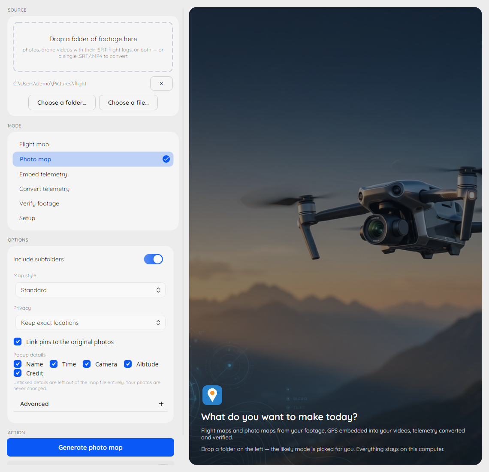
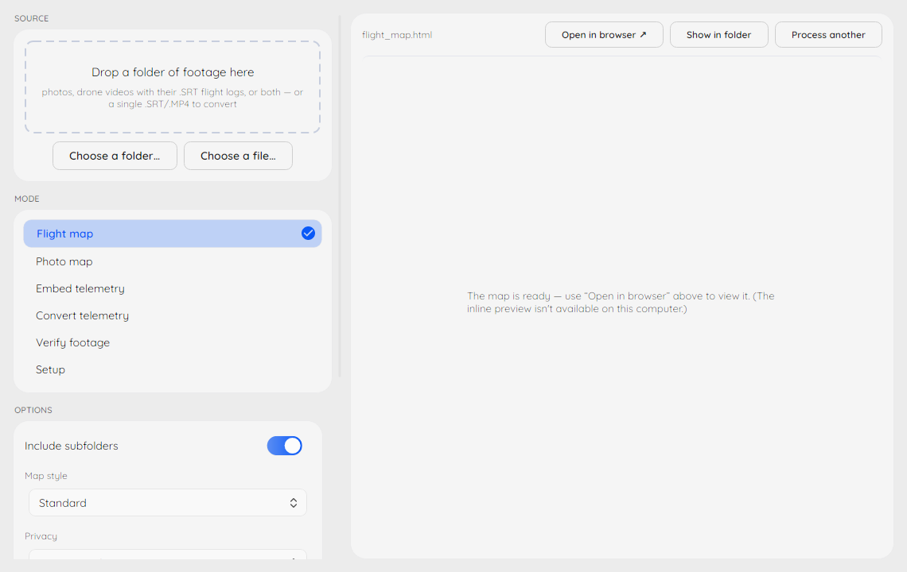
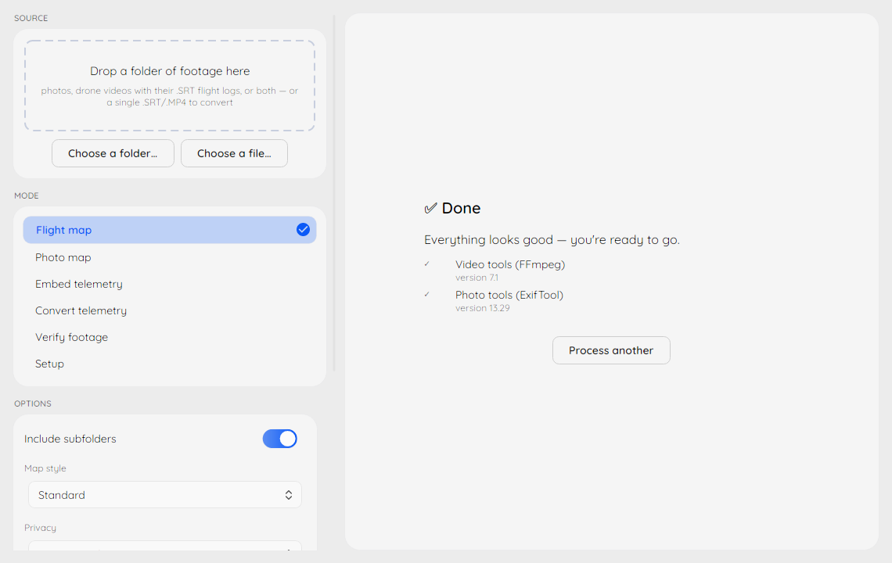

# Desktop App

The **DJI Metadata Embedder** desktop app is a Windows and macOS
front-end for the `dji-embed` command line: drop a folder of footage,
pick what to make, and watch the exact CLI command it runs in the strip
under the Run button — everything the app does, the terminal can do too.

## Install

**Windows:** download the installer
(`dji-metadata-embedder-setup-<version>.exe`) from the
[latest release](https://github.com/CallMarcus/dji-drone-metadata-embedder/releases/latest)
and run it — no admin rights needed. You get the desktop app in the Start
menu plus the full `dji-embed` command line in any terminal, with FFmpeg
and ExifTool bundled.

Already using winget? `winget install CallMarcus.DJIMetadataEmbedder`
installs the portable command line only — the desktop app ships with the
installer.

**macOS** (Apple Silicon, macOS 14+): download the signed, notarized DMG
(`dji-metadata-embedder-<version>-macos-arm64.dmg`) from the same page
and drag the app to Applications. FFmpeg and ExifTool come from Homebrew
(`brew install ffmpeg exiftool`) — the Setup screen confirms the app
found them. Full details in [Installation](installation.md#macos).

## The seven modes

Drop a folder (or a single `.SRT`/`.MP4` file) into **Source** and the
likely mode is picked for you. The **Mode** strip offers:

- **Flight map** — one interactive map of every flight in the folder,
  with playback. Needs videos with their `.SRT` flight logs. A **3D
  terrain map** toggle renders the flights draped over real terrain
  instead (writes `flightmap-3d.html`, so the flat map is never
  overwritten). An **Airspace zones** option overlays official zone
  data on either map (US FAA, plus ED-269 feeds where a country
  publishes one), fetched from the official sources and cached beside
  the map for reuse; on the 3D map, published ceilings become
  translucent volumes.
- **Photo map** — your still photos pinned on a map, including a full
  360° panorama viewer for drone panoramas.
- **Embed telemetry** — writes each flight log's GPS track into the video
  files themselves (as copies — originals are never touched).
- **Convert telemetry** — one flight log or video into GPX, KML, CSV,
  GeoJSON, CoT or a standalone web map, for Google Earth and mapping
  tools.
- **Verify** — checks embedded metadata, video/log pairing drift, or
  cross-checks the recorded time and place against the sun's position.
- **360° views** — opens the panorama opening-view editor
  (`dji-embed panoedit`) on the folder: drag each 360° panorama to the
  view it should open with, and Save writes the GPano tags the photo
  map and Google Photos honour. By default oversized panoramas are
  shown downscaled so older graphics cards can display them (the files
  and the saved view are identical either way); an **Edit at full
  resolution** option turns that off for machines with a capable
  graphics card.
- **Setup** — confirms FFmpeg and ExifTool are ready, and can install
  what's missing.

Each mode shows a small set of curated options — the full flag surface
stays on the [command line](user_guide.md). The strip under the Run
button always shows the exact `dji-embed` command those options build.

## Maps preview inside the app

Finished maps open right in the app, panoramas included:

Inline preview uses Microsoft Edge WebView2 on Windows (preinstalled from
Windows 11 on) and the system WKWebView on macOS (always present).
Without a usable WebView the app quietly opens results in your browser
instead — nothing is lost.

## Privacy and stored state

Everything runs on your computer; nothing is uploaded, and there is no
telemetry. The app stores exactly two things locally in
`%APPDATA%\DjiEmbed\state.json` on Windows
(`~/Library/Application Support/DjiEmbed/state.json` on macOS): your
recent folders and the window size/position. Delete that file to reset
both.

Beside it, `helper.log` keeps what the app's map and editor helpers
printed — the same lines the command line shows in its terminal, such as
how long each 360° view save took. It is capped at about half a megabyte
(one older rotation is kept as `helper.log.1`), never leaves your
machine, and exists so a problem report can quote real numbers — see
[Troubleshooting](troubleshooting.md#saving-a-360-view-hangs-and-the-save-button-stops-responding).
Delete it freely.
